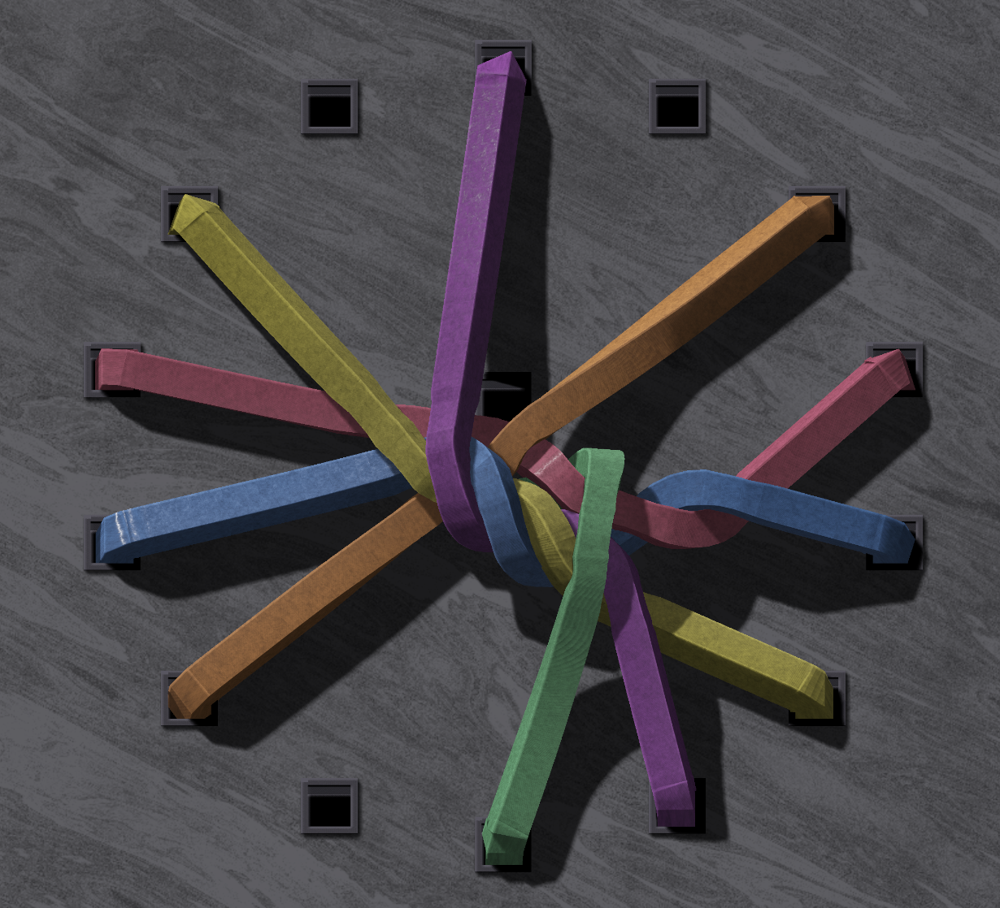

# UzlsFour

iOS-игра-головоломка про распутывание резинок между отверстиями на доске.

## Что это

Игрок перетаскивает концы резинок между отверстиями, чтобы убрать пересечения. Когда резинка перестает пересекать другие, она плавно исчезает. Уровень завершен, когда все резинки убраны.

## Технологии

- Swift + SwiftUI
- Metal (рендеринг)
- Собственный физический движок на Verlet integration + PBD constraints
